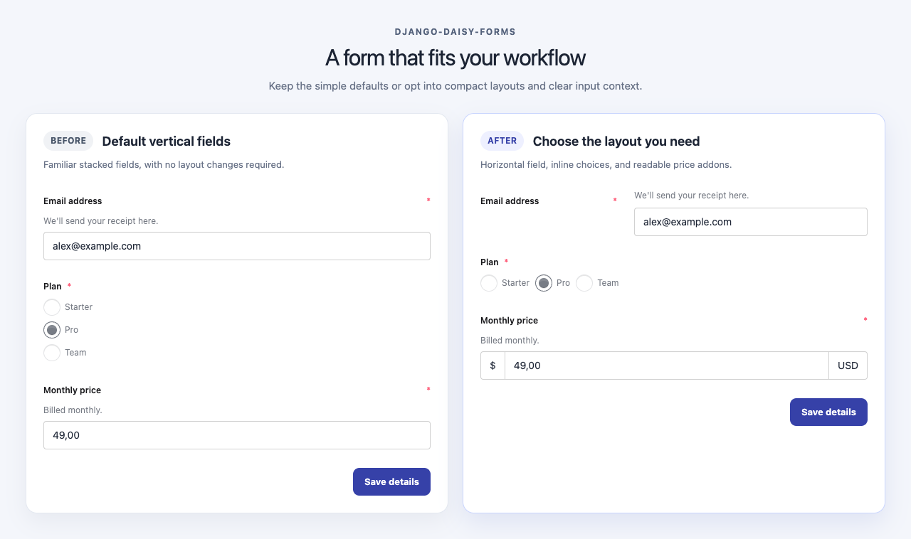

# Layouts & addons

Fields stay stacked by default. django-daisy-forms provides opt-in layouts for horizontal fields, inline choices, and text addons.



## Horizontal fields

The `field_horizontal.html` template places the label beside the control at larger breakpoints:

```django


```

On narrow screens, the label and control stack vertically. From the `md` breakpoint, they sit side by side.


## Inline choices

For `RadioSelect` and `CheckboxSelectMultiple` widgets, use `choices="inline"` to lay out options in a wrapping row:

```django



```

The default choice layout is vertical.

### Restrictions

`choices="inline"` only works with:

- `RadioSelect` widgets
- `CheckboxSelectMultiple` widgets

It does **not** work with:

- `Select` widgets
- Widgets with custom choice templates
- Any other value besides `inline`

Unsupported combinations raise a `TemplateSyntaxError` at render time.

## Text addons

Use `prefix` and `suffix` to add text before or after an input:

```django



```

Addons are wrapped in a `join` container:

```html
<div class="join w-full">
  <span class="input input-bordered join-item w-auto">$</span>
  <input type="number" name="price" class="input input-bordered join-item flex-1" id="id_price">
  <span class="input input-bordered join-item w-auto">USD</span>
</div>
```

### Addon styling

Addons copy the input's daisyUI modifiers so the group renders as one control:

- Size: `input-sm`, `input-md`, `input-lg`, `input-xl`
- Color: `input-primary`, `input-secondary`, etc.
- Error: `input-error` when the field is invalid

Example with a small input:

```django

```

The addon spans get `input-sm` to match.

### Restrictions

`prefix` and `suffix` only work with:

- Stock, visible, single-line widgets rendered with daisyUI's `input` component
- `TextInput`, `EmailInput`, `URLInput`, `NumberInput`, `PasswordInput`
- `NativeDateInput`, `NativeTimeInput`, `NativeDateTimeInput`

They do **not** work with:

- Hidden inputs
- Checkboxes, radios, toggles
- File inputs
- Range inputs
- Color inputs
- Widgets with custom templates
- `Textarea`, `Select`, and other non-`input` widgets

Unsupported combinations raise a `TemplateSyntaxError` at render time.

### Text only

Addon values are escaped and do not accept HTML or icon markup:

```django

```

To use icons or complex markup, override the field template.

## Combining layouts

You can combine horizontal fields with inline choices and addons:

```django

<form method="post">
  
  <fieldset>
    <legend>Account</legend>
    
  </fieldset>
  <fieldset>
    <legend>Plan and features</legend>
    
    
  </fieldset>
  <fieldset>
    <legend>Pricing</legend>
    
  </fieldset>
  <div class="flex flex-col gap-3 sm:flex-row sm:justify-end">
    <button class="btn btn-ghost" type="reset">Reset</button>
    <button class="btn btn-primary" type="submit">Save</button>
  </div>
</form>
```

## Composed forms

Use ordinary Django template markup to group fields and place actions. This keeps the form structure in your project, with no package layout API:

```django

<form method="post">
  
  <fieldset>
    <legend>Account</legend>
    
  </fieldset>
  <div class="flex gap-3">
    <button class="btn btn-primary" type="submit">Save</button>
  </div>
</form>
```
