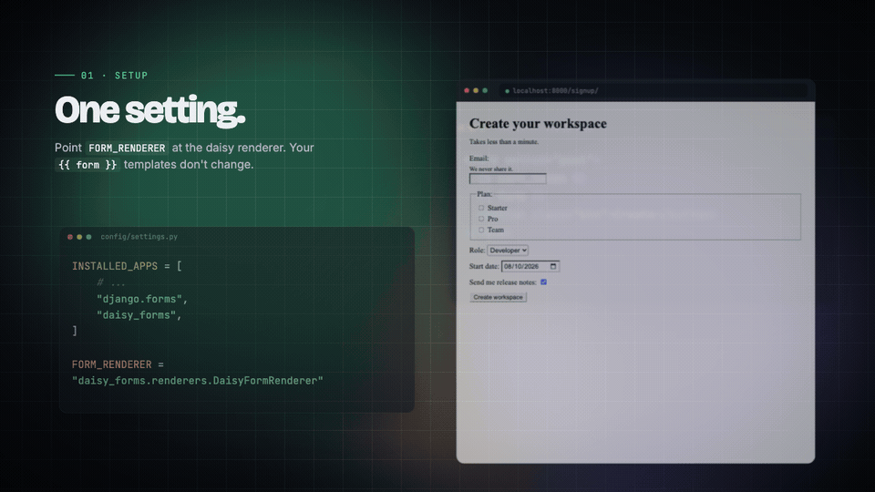

# Rendering forms

django-daisy-forms maps Django widgets to daisyUI components through a class registry. This page explains how the rendering works and what markup is produced.



## How rendering works

When you set `FORM_RENDERER = "daisy_forms.renderers.DaisyFormRenderer"`, Django uses a custom renderer that:

1. Sets `bound_field_class = DaisyBoundField` — every `{{ form.field }}` becomes a `DaisyBoundField`
2. Sets `field_template_name = "daisy_forms/field.html"` — field groups use the package's template
3. Sets `form_template_name = "daisy_forms/form.html"` — forms use the package's template
4. Sets `formset_template_name = "daisy_forms/formset.html"` — formsets use the package's template

The `DaisyBoundField` looks up the widget's daisyUI class from a registry and applies it when the widget renders. Django's global widget templates are never overridden.

## Widget class mapping

Every Django widget gets a daisyUI component class:

| Django widget                                                         | daisyUI class | Example                                       |
| --------------------------------------------------------------------- | ------------- | --------------------------------------------- |
| `TextInput`, `EmailInput`, `URLInput`, `NumberInput`, `PasswordInput` | `input`       | `<input class="input">`                       |
| `Textarea`                                                            | `textarea`    | `<textarea class="textarea">`                 |
| `Select`                                                              | `select`      | `<select class="select">`                     |
| `CheckboxInput`                                                       | `checkbox`    | `<input type="checkbox" class="checkbox">`    |
| `RadioSelect`                                                         | `radio`       | `<input type="radio" class="radio">`          |
| `CheckboxSelectMultiple`                                              | `checkbox`    | `<input type="checkbox" class="checkbox">`    |
| `FileInput`, `ClearableFileInput`                                     | `file-input`  | `<input type="file" class="file-input">`      |
| `Toggle` (package widget)                                             | `toggle`      | `<input type="checkbox" class="toggle">`      |
| `NativeDateInput`                                                     | `input`       | `<input type="date" class="input">`           |
| `NativeTimeInput`                                                     | `input`       | `<input type="time" class="input">`           |
| `NativeDateTimeInput`                                                 | `input`       | `<input type="datetime-local" class="input">` |
| Any input with `type="range"`                                         | `range`       | `<input type="range" class="range">`          |

!!! note

    `HiddenInput` receives no class. Third-party or custom widgets that are not in the registry render unchanged inside the field wrapper.

## Field markup

Every field renders with a consistent structure. This is the actual output for
an `EmailField` with help text:

```html
<div class="fieldset">
<label class="fieldset-legend" for="id_email">Email<span class="text-error" aria-hidden="true"> *</span></label>
<p class="label" id="id_email_helptext">We never share it.</p>
<input type="email" name="email" maxlength="320" required aria-describedby="id_email_helptext" class="input w-full" id="id_email">
</div>
```

Widgets that Django renders as a group (`RadioSelect`, `CheckboxSelectMultiple`)
use a `<fieldset>` and `<legend>`:

```html
<fieldset class="fieldset" aria-describedby="id_plan_helptext">
<legend class="fieldset-legend">Plan<span class="text-error" aria-hidden="true"> *</span></legend>
<p class="label" id="id_plan_helptext">Change any time.</p>
<div id="id_plan" class="flex flex-col gap-2"><label class="label" for="id_plan_0"><input type="radio" name="plan" value="basic" required class="radio" id="id_plan_0"> Basic</label>
<label class="label" for="id_plan_1"><input type="radio" name="plan" value="pro" required class="radio" id="id_plan_1"> Pro</label>
</div>
</fieldset>
```

For single checkboxes and toggles, the control sits inside its label:

```html
<div class="fieldset">
<label class="label" for="id_terms"><input type="checkbox" name="terms" required class="checkbox" id="id_terms"> I accept the terms<span class="text-error" aria-hidden="true"> *</span></label>
</div>
```

See [Validation & errors](validation.md) for the markup of an invalid field.

## Element order

Fields follow this order:

1. Label (or legend for grouped choices)
2. Help text
3. Errors (when present)
4. Control

Single checkboxes and toggles put the control inside the label, followed by
help text and errors.

## Form markup

`DaisyFormRenderer` renders forms with `daisy_forms/form.html`. It receives
Django's form rendering context: `errors` (non-field errors, including errors
from hidden fields), `fields` (pairs of visible bound field and its errors), and
`hidden_fields`.

```django
--8<-- "src/daisy_forms/templates/daisy_forms/form.html"
```

## Formset markup

Formsets render the management form, then non-form errors, then each form:

```django
--8<-- "src/daisy_forms/templates/daisy_forms/formset.html"
```

## Custom widgets

Custom widgets that are not in the registry render inside the field wrapper but without daisyUI classes. To style a custom widget, either:

1. Subclass a registered widget (e.g., `class MyInput(TextInput)`)
2. Pass classes through widget `attrs`: `widget=MyWidget(attrs={"class": "input"})`

Third-party widgets with custom templates are left untouched by design.
