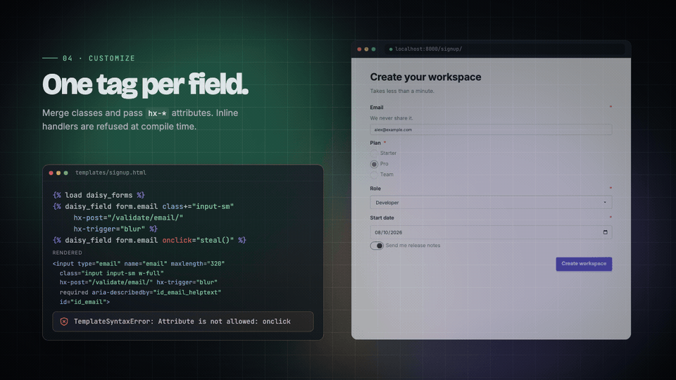

# Tailwind CSS integration

The package requires Tailwind CSS 4.1 or later and daisyUI 5.0.36 or later. Tailwind does not scan `site-packages`, so the package ships its classes as a source file that you generate in your project.



## The CSS contract

The package emits daisyUI classes like `input`, `select`, `checkbox`, and layout classes like `fieldset`, `fieldset-legend`, `join`, `join-item`. Tailwind needs to know about these classes to include them in the compiled CSS.

Since Tailwind scans files as plain text and does not scan `site-packages`, the package provides a management command that generates an `@source inline()` file listing every class the package uses.

## Generating the CSS source file

Run the management command in your project:

```bash
python manage.py daisy_forms_css --output static/src/daisy-forms.css
```

This creates a file like:

```css
/* Generated by django-daisy-forms 0.1.0. */
@source inline("alert alert-error alert-soft checkbox checkbox-error fieldset fieldset-legend file-input file-input-error flex flex-1 flex-col flex-row flex-wrap gap-2 input input-error join join-item label md:flex md:flex-row md:gap-6 md:items-start md:shrink-0 md:w-48 min-w-0 radio radio-error range range-error select select-error text-error text-sm textarea textarea-error toggle toggle-error w-auto w-full");
```

Commit this file to your repository.

## Importing the file

Import the generated file after Tailwind and daisyUI in your main CSS file:

```css
@import "tailwindcss";
@plugin "daisyui";
@import "./daisy-forms.css";
```

Adjust the path to match where you generated the file.

## CI check

To catch drift in CI, use the `--check` flag:

```bash
python manage.py daisy_forms_css --output static/src/daisy-forms.css --check
```

This exits with status 1 if the file differs from what would be generated. Add this to your CI pipeline after `daisy_forms_css` is run.

Example GitHub Actions step:

```yaml
- name: Check daisy-forms CSS
  run: python manage.py daisy_forms_css --output static/src/daisy-forms.css --check
```

## Upgrading the package

When you upgrade django-daisy-forms, regenerate the CSS source file:

```bash
python manage.py daisy_forms_css --output static/src/daisy-forms.css
```

The generated file includes a header comment with the package version, so you can see when it was last updated.

## Path-based source (local development only)

For local development, you can use a path-based `@source` instead of `inline()`:

```bash
python manage.py daisy_forms_css --print-source-path
```

This prints:

```css
@source "/path/to/site-packages/daisy_forms/templates";
```

!!! warning

    Path-based `@source` breaks across virtual environments and Docker containers. Use `inline()` for production and committed files.

## Template scanning

Tailwind scans files as plain text, so dynamically built class names are invisible. The package guarantees that every class literal in its templates appears in the generated `@source inline()` file.

If you override package templates in your project, those templates are scanned normally by Tailwind (they live in your project directory).

## Why not path-based @source?

Path-based `@source` into `site-packages` is fragile:

- Virtual environment paths differ between developers
- Docker containers have different paths
- CI environments may not have the same structure

The `inline()` approach is explicit, committed, and works everywhere.

## Verifying the build

After generating the file and building your CSS, verify that the compiled CSS includes the package classes:

```bash
grep "input-bordered" static/css/main.css
```

If the classes are missing, check that:

1. The generated file is imported after Tailwind and daisyUI
2. Tailwind is scanning the generated file
3. daisyUI is emitting the component CSS
