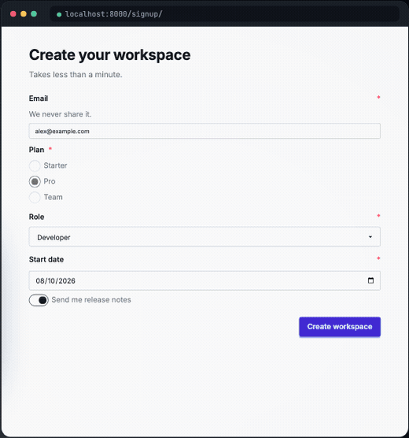

# Themes

The package uses daisyUI component classes, so any daisyUI theme applies through `data-theme` with nothing to configure in the package.



## Applying a theme

Set `data-theme` on the `<html>` element or any container:

```html
<html data-theme="dark">
  <!-- All forms use the dark theme -->
</html>
```

Or on a specific form:

```html
<form data-theme="cupcake">
  <!-- This form uses the cupcake theme -->
</form>
```

## Available themes

daisyUI ships with 32 themes. Some popular ones:

- `light` (default)
- `dark`
- `cupcake`
- `bumblebee`
- `emerald`
- `corporate`
- `synthwave`
- `retro`
- `cyberpunk`
- `valentine`
- `halloween`
- `garden`
- `forest`
- `aqua`
- `lofi`
- `pastel`
- `fantasy`
- `wireframe`
- `black`
- `luxury`
- `dracula`
- `cmyk`
- `autumn`
- `business`
- `acid`
- `lemonade`
- `night`
- `coffee`
- `winter`
- `dim`
- `nord`
- `sunset`

See the [daisyUI themes documentation](https://daisyui.com/docs/themes/) for the full list and previews.

## Theme switching

To let users switch themes, use JavaScript to set `data-theme`:

```html
<select onchange="document.documentElement.setAttribute('data-theme', this.value)">
  <option value="light">Light</option>
  <option value="dark">Dark</option>
  <option value="cupcake">Cupcake</option>
  <option value="synthwave">Synthwave</option>
</select>
```

Or with Alpine.js:

```html
<div x-data="{ theme: 'light' }">
  <select x-model="theme" @change="document.documentElement.setAttribute('data-theme', theme)">
    <option value="light">Light</option>
    <option value="dark">Dark</option>
  </select>

  <form :data-theme="theme">
    <!-- Form uses the selected theme -->
  </form>
</div>
```

## System preference

To respect the user's system preference:

```html
<script>
  const theme = window.matchMedia('(prefers-color-scheme: dark)').matches ? 'dark' : 'light';
  document.documentElement.setAttribute('data-theme', theme);
</script>
```

## No package configuration

The package does not have a theme setting. Themes are pure CSS (`data-theme`), so there is nothing to configure in django-daisy-forms. Just use daisyUI's theme system.

## Custom themes

You can create custom daisyUI themes in your Tailwind config:

```js
// tailwind.config.js
module.exports = {
  daisyui: {
    themes: [
      "light",
      "dark",
      {
        mytheme: {
          "primary": "#ff00ff",
          "secondary": "#00ffff",
          // ...
        },
      },
    ],
  },
}
```

Then use your custom theme:

```html
<html data-theme="mytheme">
```

See the [daisyUI custom themes documentation](https://daisyui.com/docs/themes/#-5) for details.
